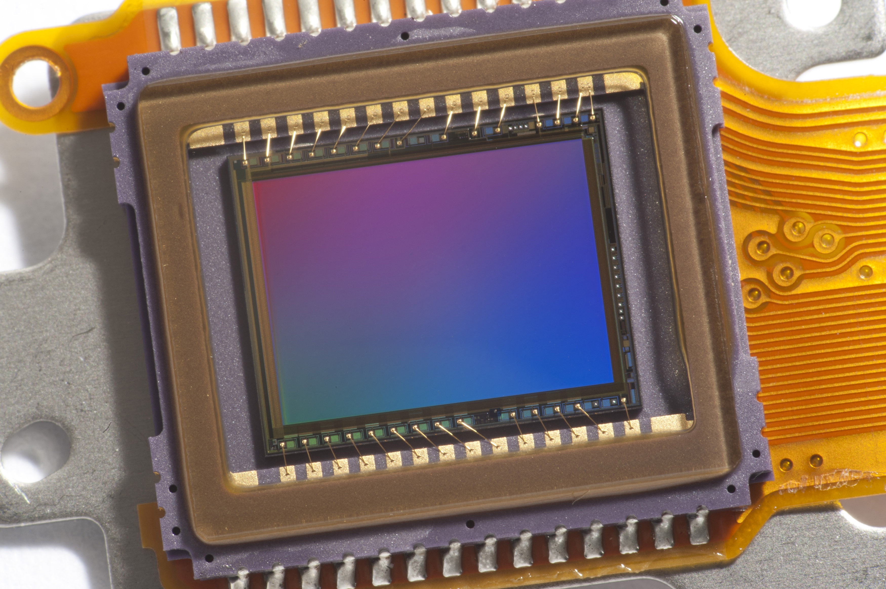

# O que é Visão Computacional :thinking:?

No ano de 1982, Ballard e Brown, na obra Computer Vision, definiram Visão Computacional como a ciência que estuda e desenvolve tecnologias que permitem que máquinas enxerguem e extraiam características do meio, através de imagens capturadas por diferentes tipos de sensores e dispositivos. Essas informações extraídas permitem reconhecer, manipular e processar dados sobre os objetos que compõem a imagem capturada.

## Conceitos fundamentais

### Natureza da Luz

Sendo radiação eletromagnética, a luz apresenta um comportamento ondulatório caracterizado por sua frequência $f$ e comprimento de onda $λ$. A faixa do espectro eletromagnético à qual o sistema visual humano é sensível se estende aproximadamente de $400$ a $770 nm$ e denomina-se luz visível. Radiação eletromagnética com comprimentos de onda fora desta faixa não é percebida pelo olho humano. Dentro dessa faixa, o olho percebe comprimentos de onda diferentes como cores distintas, sendo que fontes de radiação com um único comprimento de onda denominam-se monocromáticas e a cor da radiação denomina-se cor espectral pura. O espectro eletromagnético é a distribuição da intensidade da radiaçãoeletromagnética com relação ao seu comprimento de onda e/ ou freqüência. Na figura abaixo temos o espectro eletromagnético visível.

### Modelos cromáticos

Objetos que emitem luz visível são percebidos em função da soma das cores espectrais emitidas. Tal processo de formação é denominado aditivo. O processo aditivo pode ser interpretado como uma combinação variável em proporção de componentes monocromáticas nas faixas espectrais associadas às sensações de cor verde, vermelho e azul, as quais são responsáveis pela formação de todas as demais sensações de cores registradas pelo olho humano. Assim, as cores **verde**, **vermelho** e **azul** são ditas cores *primárias*. Este processo de geração suscitou a concepção de um modelo cromático denominado **RGB (Red, Green, e Blue)**, para o qual a Comissão Internacional de Iluminação **(CIE)** estabeleceu as faixas de comprimento de onda das cores primárias. A combinação dessas cores, duas a duas e em igual intensidade, produz as cores *secundárias*, **Ciano**, **Magenta** e **Amarelo**.

A cor oposta a uma determinada cor secundária é a cor primária que não entra em sua composição. Assim, o **verde** é oposto ao **magenta**, o **vermelho** ao **ciano** e o **azul** ao **amarelo**. A cor **branca** é gerada pela combinação balanceada de **vermelho**, **verde** e **azul**, assim como pela combinação de qualquer cor secundária com sua oposta. Objetos que não emitem radiação eletromagnética visível própria são, em contraposição, percebidos em função dos pigmentos que os compõem. Assim sendo, objetos diferentemente pigmentados absorvem (ou
subtraem) da radiação eletromagnética incidente uma faixa do espectro visível, refletindo o
restante. O processo de composição cromática pode ser interpretado como a absorção ou
reflexão, em proporções variáveis, das componentes verde, vermelho e azul da radiação
eletromagnética visível incidente. Tome-se como exemplo um objeto amarelo. As componentes
vermelha e verde da luz branca incidente são refletidas, enquanto a componente azul é subtraída
por absorção pelo objeto. Assim, a cor amarela pode ser encarada como o resultado da subtração
do azul da cor branca. As cores primárias no modelo CMY são definidas em função da
absorção de uma cor primária da luz branca incidente e da reflexão das demais
componentes, ou seja, as cores primárias são as secundárias do modelo RGB - Ciano,
Magenta e Amarelo

## Funcionamento das cameras digitais

Existem dois tipos de sensores que são utilizados para capturar uma imagem, mas resumidamente esses dispositivos tem a capacidade de converter luz em elétrons.

### Charge Coupled Device(Sensor de dispositivo de carga acoplada)

Os sensores CCD usam uma matriz de capacitores fotossensíveis para capturar a luz da cena, transformá-la em imagem digital e transferi-la para o sistema de memória da câmera. Para facilitar o entendimento, imagine esse sensor como milhares de minúsculas placas solares, dessas que captam a luz para gerar energia elétrica.

Uma vez obtida a intensidade luminosa incidente em cada uma dessas células (capacitores fotossensíveis), um conversor analógico para digital (A/D) é usado para transformar o valor da tensão elétrica, obtida de forma analógica, em um valor binário.

### Complementary Metal-Oxide Semiconductor(Sensores semicondutores de metal-óxido complementar)

Os sensores CMOS seguem o mesmo princípio de funcionamento: atuam convertendo luz em eletricidade e representando cores através de filtros coloridos sobrepostos às células. A principal diferença é que os CMOS, ao capturar a luz incidente sobre as células, não necessitam de um conversor A/D para converter o sinal analógico em um sinal digital.

  
*Matriz de capacitores CCD e CMOS*
## Imagens Digitais

Entenda como imagem digital, uma matriz de M linhas e N colunas, cada elemento dessa grade retangular nos chamamos de pixel. Se a imagem digital contiver M linhas e N colunas, o índice M
variará de 0 a M-1, enquanto n variará de 0 a N-1. Observe-se o sentido de leitura (varredura)
e a convenção usualmente adotada na representação espacial de uma imagem digital.

Usamos o sistema RGB para representar nosssa imagem, portando, para cada pixel de uma imagem em RGB, temos a intensidade de luz vermelha, verde e azul representada no
mesmo pixel.  

São necessários 8 bits  para  registrar a intensidade luminosa de cada uma das cores primárias, logo, uma imagem em
RGB geralmente necessita de 24 bits para representar cada pixel.  

Conceitualmente,  uma imagem  em  RGB  pode  ser  vista  como três  matrizes  bidimensionais,  sendo  que  cada  matriz  armazena cada canal de cor – ou seja, uma matriz para representar a imagem
segundo  a intensidade  de  cor  vermelha,  outra  para  a intensidade Imagens em RGB
de verde e outra para a de azul.

Uma outra forma de pensar é considerar a imagem como uma matriz tridimensional, L x C x 3, em que L é o número de linhas e
C  de  colunas, permitindo que 3 valores  sejam  armazenados para cada pixel.

